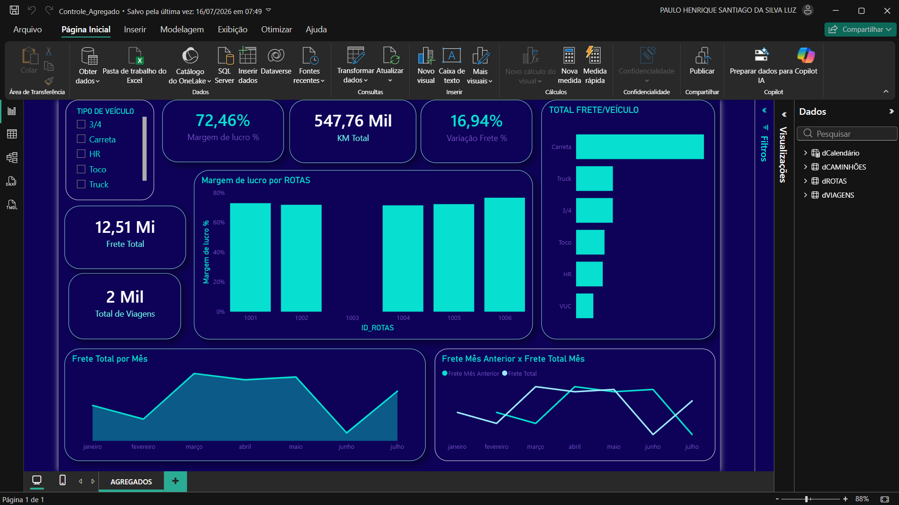

# 🚛 Dashboard de Controle de Agregados — Análise de Frota (Power BI)

> Projeto de Business Intelligence ponta a ponta: da modelagem dos dados à visualização, transformando dados operacionais de uma transportadora em insights de negócio.




---

## 📌 Sobre o projeto

### 🩹 O problema

Este projeto parte de um cenário fictício: uma transportadora de médio porte que controla frete e margem por viagem em planilhas com dezenas de colunas. Sem uma visão consolidada, perguntas simples como “essa rota está dando lucro de verdade?” ou “vale a pena mandar uma carreta pra esse trajeto?” ficavam sem resposta rápida, e a escolha do veículo para cada rota dependia da experiência de quem olhava a planilha, não de um número confiável e comparável. A empresa, as rotas e os dados são inventados; escolhi o setor de transporte rodoviário de cargas por ser um domínio que conheço.

### 🛠️ A solução

Construí, do zero, um dashboard em Power BI que centraliza viagens, frete, KM rodado e margem de lucro num modelo Star Schema, com medidas DAX de comparação mês a mês. Qualquer pessoa da operação consegue, em segundos, ver a margem por rota e por tipo de veículo — sem precisar abrir planilha nenhuma ou pedir pra alguém cruzar os dados manualmente.

> ⚠️ **Nota de confidencialidade:** todos os dados utilizados são **100% fictícios**, gerados por mim. 

### 📈 O resultado

O dashboard revelou que as **carretas** — o tipo de veículo com maior volume de frete movimentado — têm a **pior margem de lucro proporcional** entre os veículos analisados. É o tipo de informação que fica escondida numa planilha crua e só aparece quando se compara volume lado a lado com rentabilidade.

> 📊 **Estimativa** (baseada nos números deste modelo — que usa dados fictícios, não uma economia real auditada): se a operação redirecionasse parte do frete hoje concentrado em carretas de baixa margem para veículos com melhor relação custo/benefício na mesma rota, o ganho de margem mensal poderia ficar na faixa de **alguns milhares de reais**. Não é um valor exato — é uma estimativa ilustrativa do tipo de decisão de alocação de frota que passa a ser possível quando existe visibilidade de dado, em vez de decisão por "feeling".

**Pergunta de negócio central:** *Como está a performance de frete da frota — qual a margem de lucro por rota, por tipo de veículo, e como a receita evolui mês a mês?*

---

## 🎯 Objetivos

O painel foi construído para responder, de forma direta, às seguintes perguntas de negócio:

- Qual o frete total e como ele variou mês a mês?
- Quais rotas dão mais lucro?
- Qual tipo de veículo tem maior margem de lucro?
- A margem de lucro está dentro da meta de margem definida no cenário (ex.: 14%)?

---

## 🛠️ Ferramentas e técnicas

| Categoria | Tecnologias |
|---|---|
| Visualização & Modelagem | Power BI Desktop |
| Linguagem de Medidas | DAX (Data Analysis Expressions) |
| Modelagem de Dados | Star Schema (Esquema Estrela) |
| Preparação de Dados | Excel Avançado, Power Query |
| Consulta de Dados | SQL (JOINs, Subqueries, CTEs, Window Functions) |

---

## 🗂️ Arquitetura dos dados — Star Schema

A modelagem seguiu o padrão Star Schema, com a tabela fato `fVIAGENS` conectada às dimensões `dCAMINHÕES`, `dROTAS` e `dCalendario` (tabela calendário criada via DAX para permitir Time Intelligence). Esse padrão foi escolhido por trazer melhor performance nas consultas e mais facilidade de manutenção do modelo — o padrão usado em ambientes profissionais de BI.

```
              ┌───────────────────┐
              │    dCalendário    │
              └─────────┬─────────┘
                        │
  ┌──────────────┐  ┌───▼────────────┐  ┌──────────────┐
  │  dCAMINHÕES  │  │   fVIAGENS     │  │   dROTAS     │
  │ (tipo, placa)├─►│    (FATO)      │◄─┤ (origem/     │
  └──────────────┘  │ KM, Frete,     │  │  destino)    │
                    │ Pedágio, etc.  │  └──────────────┘
                    └────────────────┘
```

**Tabela fato (`fVIAGENS`):** cada linha é uma viagem, contendo KM rodado, valor de pedágio, combustível, total de frete produzido e total pago ao motorista.

**Dimensões:** Caminhões (tipo, placa, motorista, proprietário), Rotas (cidade/estado de origem e destino) e Calendário.

### Tratamento dos dados (Power Query)

Os dados foram tratados no Power Query: remoção de duplicados nas dimensões, ajuste dos tipos de cada coluna, tratamento de erros e eliminação de colunas em branco — deixando a base pronta para uma modelagem e visualização mais confiáveis.

---

## 📐 Medidas DAX desenvolvidas

As principais métricas foram criadas como **medidas** (não colunas calculadas), para garantir desempenho e o contexto de filtro correto:

```dax
Total Frete = SUM(fViagens[TOTAL DE FRETE PRODUZIDO])

Total KM = SUM(fViagens[KM RODADO])

Margem de Lucro % =
DIVIDE(
    [Total Frete] - SUM(fViagens[TOTAL PAGO AO MOTORISTA]),
    [Total Frete]
)
```

**Inteligência de tempo (Time Intelligence):**

```dax
Frete Mês Anterior =
CALCULATE(
    [Total Frete],
    DATEADD(dCalendario[Data], -1, MONTH)
)

Variação % =
DIVIDE(
    [Total Frete] - [Frete Mês Anterior],
    [Frete Mês Anterior]
)
```

> 💡 Essa medida de margem permite identificar rotas com alto faturamento, mas baixa rentabilidade — um insight que só aparece quando se olha além da receita bruta.

---

## 📊 Visualizações do dashboard

- **KPIs principais:** Total de Frete, KM Total e Margem de Lucro %.
- **Evolução mensal do frete**, com comparação frete do mês atual vs. mês anterior.
- **Margem de lucro por rota** (gráfico de barras — escolhido em vez de rosca por ser mais legível para comparação entre categorias).
- **Total de frete por tipo de veículo** (Carreta, Truck, 3/4, Toco, HR, VUC).

### Design e experiência

A paleta azul e verde (petróleo/turquesa) foi escolhida por transmitir modernidade e segurança — transmitir modernidade e confiança, adequado ao setor de logística. Os cartões de KPI foram posicionados no topo para leitura rápida das métricas principais antes do usuário entrar no detalhe. A escolha dos gráficos seguiu a lógica da pergunta que cada um responde: linhas para mostrar tendência do frete ao longo do tempo, e barras para comparar rotas e veículos entre si.

---

## 💡 Insights e resultados

- As **carretas** movimentam mais frete do que os outros tipos de veículo, porém apresentam a pior margem de lucro — evidenciando que volume não é sinônimo de rentabilidade.
- A oscilação no frete total mês a mês revela os períodos de maior demanda da transportadora, permitindo um planejamento melhor para o ano seguinte.
- Foi possível identificar quais rotas têm o maior KM percorrido, ajudando a evitar o envio de veículos maiores (com maior custo de combustível) sem necessidade real.
- Dashboard funcional, com modelo escalável que pode incorporar novos dados sem retrabalho.

---

## 🚀 Como foi construído

1. **Levantamento de requisitos** — definição das perguntas de negócio a partir do cenário simulado.
2. **Geração da base fictícia** — planilha com centenas de registros de viagens.
3. **Modelagem** — separação em tabela fato e dimensões (Star Schema).
4. **Transformação** — tratamento e relacionamento dos dados no Power Query.
5. **Medidas DAX** — criação das métricas de negócio e inteligência de tempo.
6. **Design** — construção do layout, escolha dos visuais e polimento.

---

## 🔭 Próximos passos

- **Alertas automáticos:** disparar um aviso (via Power BI ou automação com n8n) sempre que a margem de uma rota cair abaixo da meta de margem definida no cenário (ex.: 15%), em vez de depender de alguém abrir o dashboard para notar.
- **Cruzamento com custo de manutenção:** incorporar o custo de manutenção por caminhão à análise, trazendo uma visão de lucro ainda mais realista além do custo de combustível.

---

## 🧠 Habilidades demonstradas

`Power BI` · `DAX` · `Star Schema` · `Inteligência de Tempo` · `Power Query` · `Modelagem Dimensional` · `Storytelling de Dados` · `Excel Avançado` · `SQL`

---

## 👤 Autor

**Paulo Henrique Santiago da Silva**
Analista de Dados e Custos Logísticos | Power BI · SQL · Excel

- 🔗 LinkedIn: [linkedin.com/in/hpaulo13](https://www.linkedin.com/in/hpaulo13/)
- 📧 hpaulo669.ph@gmail.com

Este é o primeiro de uma série de projetos de portfólio construídos durante minha transição de carreira para Análise de Dados / Business Intelligence. **Próximo projeto:** análise de dados públicos reais do Tesouro Direto, com pipeline SQL (MySQL) + Power BI.
